# 🐾 ClawFin

ClawFin is a privacy-first, self-hosted, AI-native personal finance dashboard tailored for Canadians. Brutalist-minimalist UI with a teal accent, Bloomberg-terminal density, and a full command palette — built for speed, automated data ingestion, and conversational querying of your own ledger.

<p align="center">
  
</p>

## ✨ Features

- **Canadian-first ingestion**
  - CSV parsers for the Big 5 (TD, RBC, Scotiabank, BMO, CIBC).
  - Wealthsimple CSV (Holdings & Activity) with dual-currency book/market tracking.
  - **SimpleFin** sync for continuous bank feeds. Captures `pending`, `memo`, `available_balance`, and `balance_date`.
- **Accounts, Holdings, Transactions**
  - `Accounts` view groups by institution with cash / credit / registered totals.
  - `Holdings` lets you browse any historical **snapshot** you've imported (step prev/next or pick a date).
  - `Transactions` has inline category reassign (saves a rule for next time), account filter chips, sortable columns, and pending markers.
- **Recurring detection**
  - Auto-detects monthly/weekly charges (subscriptions, EMIs, rent, insurance, bills).
  - Classified by your own **Categories** — edit a row inline, it sticks.
- **Planning**
  - Net worth over time (Snapshot-backed or synthesized from posted transactions).
  - 3-month cash-flow forecast from detected recurring charges.
  - Cash-flow waterfall on the dashboard (income → categories → net).
- **AI agent**
  - Provider toggle (Ollama / OpenAI / Anthropic) — switch live, no restart.
  - Ollama model dropdown auto-fills from `/api/tags`.
  - Experimental AI categorization flag for auto-classifying new merchants.
  - Tool-using agent with streaming chat.
- **Command palette** — ⌘K opens it; arrow keys + Enter to navigate or run actions (Recategorize, Sync, Toggle theme). ⇧⌘K opens chat.
- **Theme toggle** — dark terminal or light paper; persisted; follows `prefers-color-scheme` on first load.
- **Privacy by design**
  - File-backed SQLite. One password (`CLAWFIN_PASSWORD`) gates the UI.
  - Download a full DB backup from Settings → Data.
  - No bloated frameworks; direct `httpx` calls to AI providers.

## 🏗️ Architecture

- **Backend**: Python 3.12, FastAPI, SQLAlchemy, SQLite.
- **Frontend**: React 19, Vite, Zustand, Recharts. Inter + JetBrains Mono.
- **Design**: brutalist minimalist. 1px hard rules, zero radii, zero shadows, teal accent.

## 🚀 Getting Started

### 1. Configure

```bash
cp .env.example .env
```

Set at minimum:
- `CLAWFIN_PASSWORD` — UI password.
- `CLAWFIN_SECRET_KEY` — random string (`openssl rand -hex 32`).
- `CLAWFIN_AI_PROVIDER` — `ollama`, `openai`, or `anthropic` (switchable from the UI too).

### 2. Run via Docker Compose

```bash
# Standard stack (backend + nginx frontend)
docker compose up -d

# Include a local Ollama sidecar
docker compose --profile ai-local up -d
```

Open `http://localhost:3000`, log in, and import a CSV or connect SimpleFin.

### 3. Keyboard shortcuts

- `⌘K` — Command palette (nav, actions, search).
- `⇧⌘K` — Ask ClawFin (chat).

## 🛠️ Local Development

**Backend:**
```bash
python3.11 -m venv .venv
source .venv/bin/activate
pip install -r backend/requirements.txt
CLAWFIN_PASSWORD="dev" uvicorn backend.main:app --reload
```

**Frontend:**
```bash
cd frontend
npm install
npm run dev
```

**Tests:**
```bash
PYTHONPATH=. pytest backend/tests -q
```

## 📦 Data & Backups

- SQLite DB at `~/.clawfin/clawfin.db` (host) or `/data/clawfin.db` (Docker).
- Schema auto-migrates additive columns on startup.
- Download a timestamped backup any time from **Settings → Data → Download Backup**.
- For Docker, cron a host-side copy:
  ```bash
  docker exec clawfin-backend-1 cp /data/clawfin.db /data/backups/clawfin-$(date +%F).db
  ```

## 🗺️ Roadmap

- **v0.1** (current): Foundation, ingestion, dashboard, recurring detection, planning, AI agent, command palette, theme toggle, snapshot browsing, Docker.
- **v0.2**: Budgeting + goals, multi-account reconciliation, saved chat threads, mobile-responsive layout, Alembic-backed migrations.

## 🔒 Hardening Before You Ship

- Put it behind a reverse proxy with TLS (Caddy/Traefik/nginx). Don't expose `:3000`/`:8000` directly.
- Rotate `CLAWFIN_SECRET_KEY` to a real random value.
- Off-host DB backups on a schedule.
- If using Ollama, keep it on the same private network as the backend.
